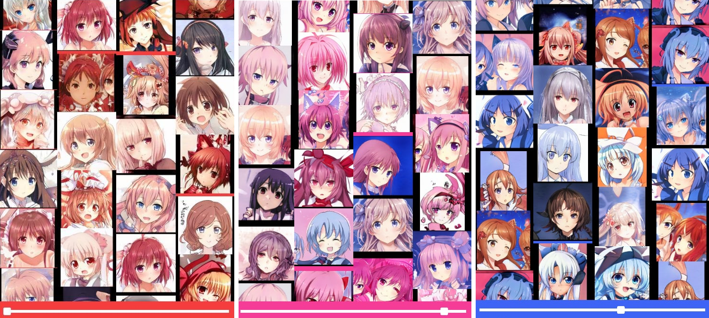

# shopify-challenge
A Django app that lets user upload colorful pictures and select what color of pictures to display in an infinite scroller in realtime via websockets.

The user has an ability to drag and drop pictures in bulk to upload to the database, as well as to delete images from the database by clicking on them.

### The flow
**Uploading**
- User drags and drops files onto the page
- The files get combined into reasonably sized chunks and are uploaded together to the server via regular POST
- Each image is processed in order to extract its 4 dominant colors, while also ignoring any boring colors like white, black and shades of gray.
- Image data is scaled down, compressed via LZMA and stored on the disk
- The appropriate record is created in the database

**Viewing**
- On page load a connection is open to the websocket server
- The websocket server queries the database of stored images to get images that fuzzily match `hue=0`in one of the stored dominant colors
- The websocket server then responds with a set of 20 initial images that fuzzily matched `hue=0`
- The websocket client decompresses received images and puts them into the scroller columns
- On change of hue via the range input the same steps are repeated, but with a different hue and with only 10 returned images
- On click on the image a websocket request is sent to the websocket server to soft-delete the image from the database

### Requirements
- Python 3 (developed in 3.9.0)
- MySQL (developed in 5.7)

### Installation
1. `git clone https://github.com/HaselLoyance/shopify-challenge.git && cd shopify-challenge`
2. `pip3 install -r requirements.txt`
3. Configure `scroller/settings.py` to use the correct database credentials on [L49](https://github.com/HaselLoyance/shopify-challenge/blob/main/scroller/settings.py#L49).
4. `python3 manage.py migrate`
5. `python3 manage.py runserver`
6.  Navigate to `127.0.0.1:8000`

### The perfect dataset
The best dataset of pictures to test this app on is the This Waifu Does Not Exist archive, available [here](https://www.gwern.net/TWDNE#downloads). It is an archive of AI-generated anime faces that come in all colors (and forms!) and that's what makes it perfect for testing. Credit: [Gwern Branwen](https://www.gwern.net/index).

### Rough benchmarks
On my old laptop it took a little under 3 minutes to bulk upload (and process dominant colors) 4000 JPEG images with a total size of ~820MB.

One must understand that Django's development server is very limited (everything is being executed in a single thread), and for its full potential the WSGI app needs to be executed behind some other web server like Apache. But to reduce the amount of prerequisites to run the code I did not set up the proper production-ready environment (as it would also require a chain of caches, and ye know, probably out of the scope of the test project).

Also, ideally the production-ready environment would be on a separate machine (and network), as files were concurrently read and written from and to the disk of my laptop during the benchmark. This, of course, also affects the performance.

### Known issues
- The client websocket does not automatically reconnect
- During huge bulk uploads (500+ files) the scroller lags behind. This is expected, since JS has to read file data from the disk, and with incoming images from the websocket we cannot really expect JS to show peak performance
- Window resize is wonky, but hey, I'm not a frontend expert /shrug
